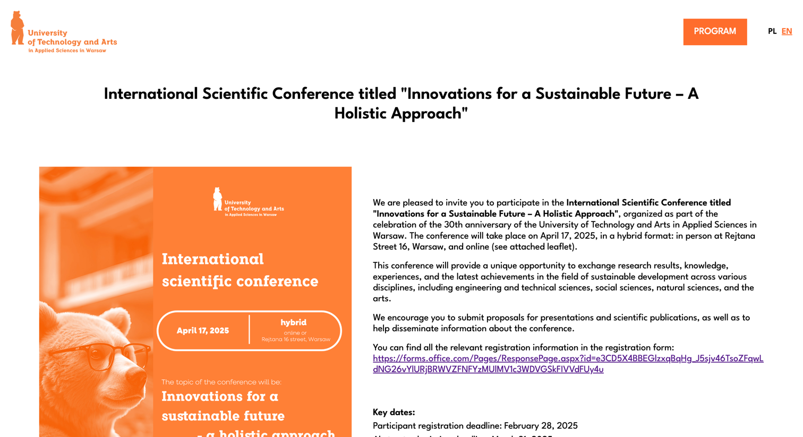
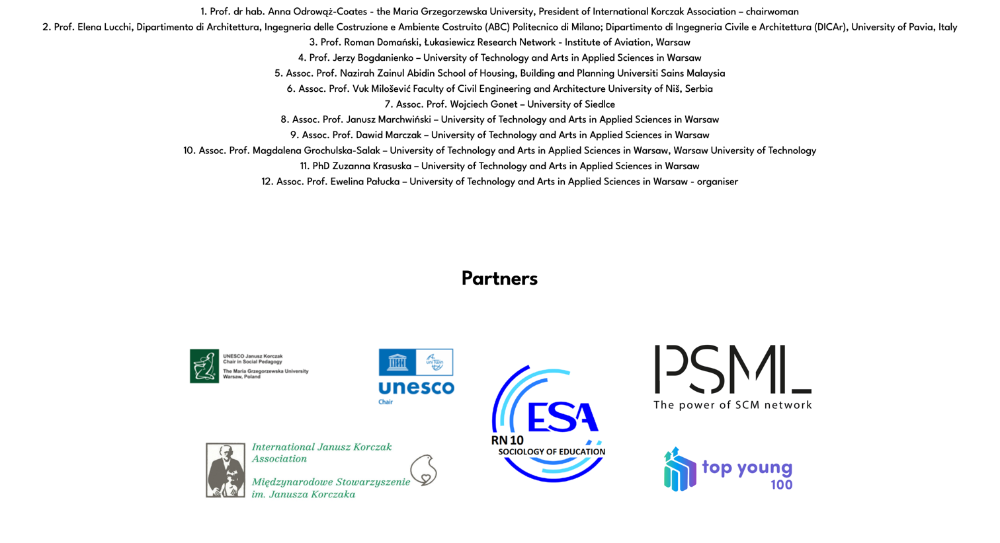
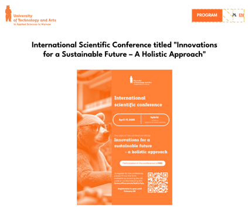

# Blog Service Java

The Java simple MVC application serves as an announcement of the university's academic conference. Also, the application includes functionality such as localization and adaptation for different devices.

## Screenshots

  
  
  

## Installation

1. Clone repository `git clone https://github.com/Vladosik12333/uni-conference-page`
2. Build project `mvn package`
3. Build image `docker build -t uni-conference-page .`
4. Start container `docker run -d -p 80:80 uni-conference-page`
5. Open [localhost](http://localhost:80/)

## Technologies

## Deployment

The application was deployed using AWS services:
- Elastic Container Service
- Elastic Container Registry
- VPC
- Route 53
- Balancer
- Certificate Manager
- IAM

## Authors

[Vladyslav Babiak - Developer](https://github.com/Vladosik12333)

## Copyright & Licensing Information

[MIT License](LICENSE)
